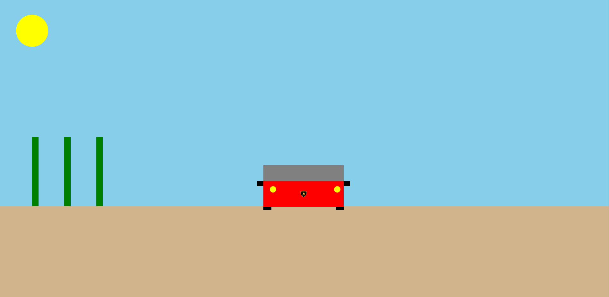

# Canvas-Desenho

Defini o tamanho do canvas
Céu: Defini a cor e criei o retangulo ficando por trás de todo o resto

Sol: Criei o circulo e posicionei e defini a cor

Estrada: defini a cor e criei o retangulo no formato de uma rua

Cactos: defini a cor e criei e posicionei os 3 retangulos

Rodas do carro: defini a cor e criei os dois retangulos posicionados atras do carro

Corpo do carro: defini a cor e criei o retangulo

para-brisa: defini a cor e criei o retangulo e posicionei acima do carro

farol: defini a cor e criei os dois circulos posicionados em frente ao carro

retrovisor: defini a cor e criei os dois retangulos posicionados do lado do carro

simbolo da fabricante: adicionei a imagem com o local dela e posicionei no meio do carro como se fosse a fabricante

